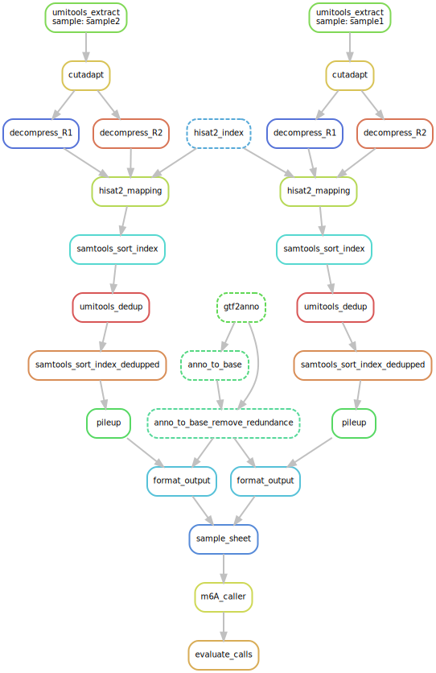

# GLORI Snakemake workflow

## Credits

This repository is little more than a [Snakemake](https://snakemake.readthedocs.io/en/stable/) wrapper for the following repositories (as well as some related scripts):

- [`jhfoxliu/GLORI_pipeline`](https://github.com/jhfoxliu/GLORI_pipeline)
- [`SYSU-zhanglab/RNA-m5C`](https://github.com/SYSU-zhanglab/RNA-m5C)

Credit is due to Fox (`jfoxliu`) for creating `GLORI_pipeline` as well as the scripts in the `scripts/` directory of this repository.

## Cloning this repository

The abovementioned repositories are included as submodules. Here is how to clone *this* repository and include the above dependencies:

    git clone --recurse-submodules https://github.com/gp-micro/glori

## Configuration

Configuration of the pipeline takes place through the file `config.yaml`, which looks like this:

    results_dir: "results"
    sample_to_fastq:
        "test1": "GLORI_pipeline/notebook/test1.fastq.gz"
        "test2": "GLORI_pipeline/notebook/test2.fastq.gz"

    hisat2_path: "MYSCRATCH/GLORI/hisat2"
    hisat2_index_dir: "MYSCRATCH/GLORI_HISAT2_INDEXES"
    reference_fasta: "PATH_TO_REF_FASTA"
    reference_gtf: "PATH_TO_REF_GTF"
    db_path: "MYSCRATCH/db_will_be_created_here"

This Snakemake workflow currently *does not* perform the steps needed to generate the HISAT2 indexes. But I plan to add them.

## Software requirements

- conda (I have been using 4.11.0 - I know, I know)
- Snakemake (I have been using version 8.16.0)
- The [HISAT2 aligner](https://daehwankimlab.github.io/hisat2/) version 2.1.0 must be compiled ([instructions here](#compiling-hisat2)) and then the path to the directory *containing* the executable must be specified as the `hisat2_path` parameter in `config.yaml`. So far I have not been able to run the scripts with a HISAT2 loaded via `bioconda` or via `module load`.

## Running

    CACHE=MYSCRATCH/snakemake_conda_cache
    snakemake --cores 10 \
        --software-deployment-method conda --conda-prefix $CACHE --conda-frontend conda \
        evaluate_calls

You may not need `--conda-frontend conda` if you have a relatively recent version of `conda`. 

## Current status of development

At the moment, this Snakemake workflow assumes you have generated the necessary HISAT2 indexes.

## Compiling HISAT2

First go to a directory where you want to build HISAT2

    git clone --branch v2.1.0 --depth 1 https://github.com/DaehwanKimLab/hisat2
    cd hisat2
    make
    pwd

Use the resulting path as the `hisat2_path` parameter in `config.yaml`.
